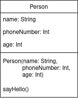
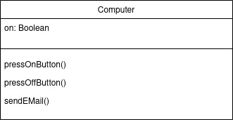
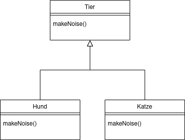

<h1 align="center">Grundlagen der Programmierung</h1>
<h3 align="center">Objektorientierte Programmierung</h3>

#### Beschreibung:

Willkommen zurück zu den Übungen an Tag 29!
Heute hast du das Prinzip der Kapselung kennengelernt. In den folgenden Aufgaben sollst du dieses Prinzip anwenden.

#### Hinweise zur Bearbeitung:

- Achte auf einen sauberen Quellcode, insbesondere Einrückungen sind wichtig!
- Wichtige Materialien für heute:
  - [Handbuch: Objektorientierte Programmierung (OOP)](https://docs.google.com/document/d/13SyoQ3tgIr4T9tiUl42V5kiBGQwV4Lk-XA2SsKf-va0/edit#heading=h.a4e6zghf5f6g)

---

 <b> Aufgabe 1 - Klasse erstellen I - Hund </b> 

Wir wollen einen Hund erstellen. Der Hund hat als Eigenschaft einen Namen 
und eine Rasse. Der Hund kann bellen.

Aufgabe:

- Erstelle (in der Datei Hund.kt) eine Hunde-Klasse.
- Erstelle (in der Datei Main.kt) eine Hunden-Instanz,
mit dem Namen "Bello" und der Rasse "Golden-Retriever".
- Lass den Hund bellen.

**Modul für die Aufgabe:** Aufgabe1  
**1. Datei für die Aufgabe:** Hund.kt  
**2. Datei für die Aufgabe:** Main.kt

---

 <b> Aufgabe 2 - Klasse erstellen II - Katze </b> 

Wir wollen eine Katze erstellen. Die Katze hat als Eigenschaften 
einen Namen und eine Fellfarbe. Die Katze kann miauen.

Aufgabe:

- Erstelle (in der Datei Katze.kt) eine Katzen-Klasse.
- Erstelle (in der Datei Main.kt) eine Katzen-Instanz, 
mit dem Namen "Mautzi" und der Fellfarbe "Schwarz".
- Lass die Katze miauen.

**Modul für die Aufgabe:** Aufgabe1  
**1. Datei für die Aufgabe:** Katze.kt  
**2. Datei für die Aufgabe:** Main.kt

---

 <b> Aufgabe 3 - Klasse erstellen III - Person </b> 

Wir wollen eine Person erstellen.

Die Person hat die Eigenschaften:
- name (Name) vom Typ String
- phoneNumber (Telefonnummer) vom Typ Int
- age (Alter) vom Typ Int

Die Person hat einen Konstruktor:
- Person(), mit den Parametern name, phoneNumber und age.  
Es speichert die übergebenen Parameter in den Eigenschaften ab.

und die Methode:
- sayHello(), das "Hallo an alle!" in der Konsole ausgibt.

Hier siehst du das Klassendiagramm für eine Person.

  

- Erstelle die Person-Klasse in der Aufgabendatei Person.kt.
- Erstelle in der main()-Funktion der Aufgabendatei Main.kt eine Person-Instanz mit beliebigen Namen, Telefonnummer und Alter.
- Lass die Person hallo sagen.

**Modul für die Aufgabe:** Aufgabe3  
**1. Datei für die Aufgabe:** Person.kt  
**2. Datei für die Aufgabe:** Main.kt

---

 <b> Aufgabe 4 - Klasse erstellen IV - Computer </b> 

Wir wollen einen Computer erstellen. Der Computer soll an- und ausschaltbar sein.  
Und wenn er an ist, soll man E-Mails verschicken können.

Der Computer hat eine Eigenschaft:
- on vom Typ Boolean, das angibt, ob der Computer gerade an (true) oder aus (false) ist.

Der Computer hat einen Konstruktor:
- Computer()

und die Methoden:
- pressOnButton(), das den Computer anmacht, wenn er noch nicht an ist.
- pressOffButton(), das den Computer ausmacht, wenn er noch nicht aus ist.
- sendEMail(), das in der Konsole "EMail sent!" ausgibt, wenn der Computer gerade an ist.

Hier siehst du das Klassendiagramm des Computers:

  

Aufgabe:

- Erstelle die Computer-Klasse in der Aufgabendatei Computer.kt.
- Erstelle in der main()-Funktion der Aufgabendatei Main.kt eine Computer-Instanz.
- Schalte den Computer dann an, versende eine E-Mail und schalte ihn wieder aus.

**Modul für die Aufgabe:** Aufgabe4  
**1. Datei für die Aufgabe:** Computer.kt  
**2. Datei für die Aufgabe:** Main.kt

---

 <b> Aufgabe 5 - Open, Override, Final und Super! </b> 

Du hast heute die Keywords **open**, **override**, **final** und **super** kennengelernt,
oder kennst sie bereits aus einer vorherigen Vorlesung.  
Hier seht ihr ein Klassendiagramm mit drei Klassen:
- Basisklasse Tier:  
Mit der Methode makeNoise() das "Animal noises..." in der Konsole ausgibt.
- Unterklasse Hund:  
Mit der Methode makeNoise() das "Woof!" in der Konsole ausgibt.
- Unterklasse Katze:  
Mit der Methode makeNoise() das "Miau." in der Konsole ausgibt.

Im Klassendiagramm kann man erkennen, das alle drei Klassen die Methode makeNoise() haben.
Das bedeutet, dass die Unterklasse die Methode makeNoise() der Basisklasse überschreiben (Override).

  

a)

- Erstelle die Klassen. 
Erstelle dazu selbstständig die Dateien, die du dafür brauchst.
- Überschreibe in den Unterklassen (Hund, Katze) die Methode makeNoise() der Basisklasse (Tier).
- Instanziiere einen Hund und eine Katze, lass sie Geräusche machen.
- In der Konsole sollte folgendes ausgegeben werden:

    
    Woof!
    Miau.

b)

Wie du sehen kannst, wird der Code der Methode makeNoise() der Basisklasse (Tier) **nicht** ausgeführt
(es wird kein "Animal noises..." in der Konsole ausgegeben).
Er wurde **überschriebene**.
Möchten wir allerdings die überschriebene Methode der Basisklasse ausführen, 
müssen wir mit dem keyword **super** die Basisklasse referenzieren.

- Füge diese Zeile Code in die makeNoise()-Methode der Hund und der Katzen-Klasse hinzu.  
`super.makeNoise()`
- Schau dir an, was jetzt in der Konsole ausgegeben wird. Es sollte folgendes ausgegeben werden:

c)

Eine überschreibende (`override fun`) Methode ist ebenfalls `open`.
Um zu verhindern, dass sie wieder überschrieben wird, kann man sie mit `final` schützen.

- Mach die Hunde-Klasse offen und schütze die überschreibende Methode (makeNoise()) mit `finalsf`

**Modul für die Aufgabe:** Aufgabe5

---

